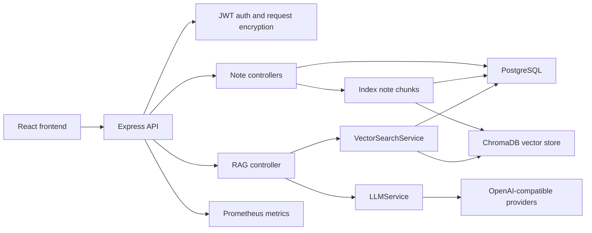

# AI Note Keeper

AI Note Keeper 是一个全栈 TypeScript 笔记知识库项目。它把 Markdown/富文本笔记、用户级 AI Provider Key、向量检索、全文检索和 RAG 问答整合到一个可本地运行、可部署到生产环境的应用中。

> 当前项目更适合作为后端/AI 应用工程作品集：它覆盖认证、数据库迁移、文件上传、安全配置、可观测性、CI/CD、向量检索和 LLM 调用链路。

## 功能特性

- 笔记管理：创建、编辑、删除、搜索笔记，支持标签、分类、Markdown 和富文本编辑。
- 文件与图片：支持 Markdown、纯文本、Word 文档导入；图片附件通过鉴权接口上传和访问。
- AI 能力：笔记总结、关键词提取、内容改写、聊天问答。
- RAG 检索：优先使用 ChromaDB 向量检索，并降级到 PostgreSQL 全文检索、模糊匹配和关键词匹配，配套质量评测和检索 metrics。
- 用户级 Provider Key：LLM 与 Embedding API Key 由用户在设置页配置，后端不依赖全局共享密钥。
- 认证与安全：JWT、邮箱验证码、请求加密、API Key 加密、CORS 白名单、Helmet、限流和请求体大小限制。
- 运维能力：OpenAPI/Swagger 文档、数据库迁移、健康检查、结构化日志、Prometheus metrics、PM2/Nginx 部署和 GitHub Actions 打包部署。

## 技术栈

**Frontend**

- React 18
- TypeScript
- Vite
- Tailwind CSS
- TipTap
- Zustand
- React Router
- react-i18next
- Vitest
- Playwright

**Backend**

- Node.js
- Express
- TypeScript
- PostgreSQL
- ChromaDB
- OpenAI-compatible SDK
- JWT
- Nodemailer
- Multer
- Pino
- prom-client
- Vitest

**Infrastructure**

- Docker Compose
- SQL migrations
- GitHub Actions
- PM2
- Nginx
- Cloudflare Full strict

## 项目结构

```text
.
├── backend/                 # Express API、业务服务、模型、迁移和后端测试
├── frontend/                # React 应用、状态管理、i18n、E2E 测试
├── deploy/                  # Nginx、ECS 部署脚本和环境配置模板
├── docs/                    # 技术复盘和架构说明
├── scripts/                 # IaC 渲染、密钥扫描和覆盖率检查脚本
├── shared/                  # 共享目录
├── docker-compose.yml       # 本地 PostgreSQL 和 ChromaDB
├── start-dev.ps1            # Windows 本地一键启动脚本
└── DEPLOYMENT.md            # 生产部署说明
```

## 架构概览



## 快速开始

### 环境要求

- Node.js 20+
- npm
- Docker Desktop
- PowerShell 5+ 或 PowerShell 7+

### 一键启动

```powershell
.\start-dev.ps1
```

脚本会执行以下操作：

1. 根据 `deploy/iac` 渲染 `backend/.env` 和 `frontend/.env.local`。
2. 启动本地 PostgreSQL 和 ChromaDB。
3. 初始化数据库 schema。
4. 分别启动后端和前端开发服务。

默认地址：

- Frontend: `http://localhost:4002`
- Backend API: `http://localhost:4000/api`
- API Docs: `http://localhost:4000/api/docs`
- ChromaDB: `http://localhost:8000`
- PostgreSQL: `localhost:5432`

### 手动启动

```bash
docker compose up -d
node scripts/iac/render-env.mjs --env local --target backend --out backend/.env --allow-example-private
node scripts/iac/render-env.mjs --env local --target frontend --out frontend/.env.local --allow-example-private
npm --prefix backend install
npm --prefix frontend install
npm --prefix backend run dev
npm --prefix frontend run dev -- --host 127.0.0.1 --port 4002
```

## 配置说明

项目的环境配置集中在 `deploy/iac`：

- `common.<target>.env`：跨环境公共默认值。
- `<env>.<target>.public.env`：可提交的环境公开配置。
- `<env>.<target>.private.env.example`：可提交的私有配置模板。
- `private/<env>.<target>.env`：真实私有配置，已被 Git 忽略。

渲染顺序是 `common` -> `public` -> `private`。生产前端应保持：

```env
VITE_API_URL=/api
```

这样可以避免 HTTPS 页面请求 HTTP API 时产生 mixed content。

校验配置：

```bash
node scripts/iac/check-env.mjs
```

LLM 和 Embedding Provider API Key 不写入服务端全局环境变量。用户登录后在 Settings 页面配置自己的 Key。

## 数据库迁移

迁移文件位于 `backend/migrations`，每个版本包含 `*.up.sql` 和 `*.down.sql`：

```bash
npm --prefix backend run build
npm --prefix backend run migrate
npm --prefix backend run migrate:rollback
```

已应用迁移记录在 `schema_migrations` 表中。

## 常用命令

```bash
# 安全和配置检查
node scripts/security/scan-secrets.mjs
node scripts/iac/check-env.mjs

# 后端
npm --prefix backend test
npm --prefix backend run build
npm --prefix backend run lint
# 需要先启动后端服务
npm --prefix backend run eval:rag

# 前端
npm --prefix frontend test
npm --prefix frontend run build
npm --prefix frontend run build:analyze
npm --prefix frontend run lint
npm --prefix frontend run test:e2e
```

## API 概览

主要接口都挂载在 `/api` 下：

- `POST /api/auth/*`：注册、登录、验证码、密码重置。
- `GET|POST|PUT|DELETE /api/notes`：笔记 CRUD 和搜索。
- `POST /api/llm/*`：聊天、总结、关键词、改写和 LLM Key 管理。
- `POST /api/embedding/*`：Embedding Provider 测试和 Key 管理。
- `POST /api/rag/ask`：基于笔记知识库问答。
- `POST /api/rag/reindex`：重建当前用户笔记索引。
- `GET /api/docs`：Swagger UI。
- `GET /api/docs/openapi.json`：OpenAPI 3.0 JSON。
- `GET /health`、`GET /health/ready`、`GET /metrics`：健康检查和监控。

RAG eval 会输出 `retrievalRecall`、`citationAccuracy` 和 `emptyContextRefusalRate`，用于检查召回、引用准确性和空上下文拒答。

技术复盘见 [docs/technical-retrospective.md](docs/technical-retrospective.md)。
检索阈值实验记录见 [docs/rag-retrieval-experiments.md](docs/rag-retrieval-experiments.md)。
前端 bundle analyzer 会生成 `frontend/dist/bundle-analysis.html`，拆分收益记录见 [docs/frontend-bundle-analysis.md](docs/frontend-bundle-analysis.md)。

## 部署

不要从本机直接部署服务器。推荐流程：

1. 推送代码到 GitHub。
2. 等待 GitHub Actions 的 **Build Package** 通过。
3. 从 workflow summary 复制 package id。
4. 手动运行 **Deploy Package**，输入 package id。

Build Package 会执行密钥扫描、IaC 配置校验、前后端测试、覆盖率检查、lint、构建、迁移验证、Playwright E2E、RAG eval 和 artifact 上传。

Deploy Package 会下载 artifact，上传到 ECS，解压到 `/opt/ai-note-keeper/releases/<package-id>`，安装生产依赖，执行迁移，切换 symlink，reload PM2/Nginx，并通过 `/health/ready` 做 smoke test。

详细说明见 [DEPLOYMENT.md](DEPLOYMENT.md)。

## 质量现状

本项目已经具备比较完整的工程化基础：

- 前后端都有 Vitest 测试。
- 前端包含 Playwright E2E。
- 后端有 OpenAPI/Swagger、Zod DTO 校验、健康检查、HTTP/RAG/security metrics、结构化请求日志和安全审计日志。
- 配置通过 IaC 模板集中管理。
- 部署流程避免直接在服务器上手工改代码。
- 前端使用路由级动态 import 降低首屏 bundle 体积。
- 后端开启 TypeScript unused 检查，避免无用集成残留。

仍建议继续补齐：

- 为更多响应体补充 OpenAPI schema，并逐步减少手写 controller 校验。
- 使用真实用户笔记和真实 Provider 做可选 nightly RAG eval。
- 把检索阈值实验升级为自动化脚本，输出可对比的 JSON 历史记录。
- 对 i18n namespace 和 Markdown preview 做更细粒度懒加载。
- 为 security events 和 RAG retrieval metrics 配置生产告警。

## License

MIT
