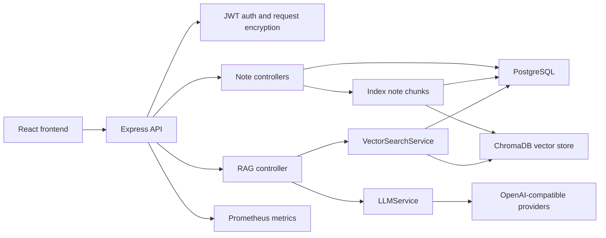
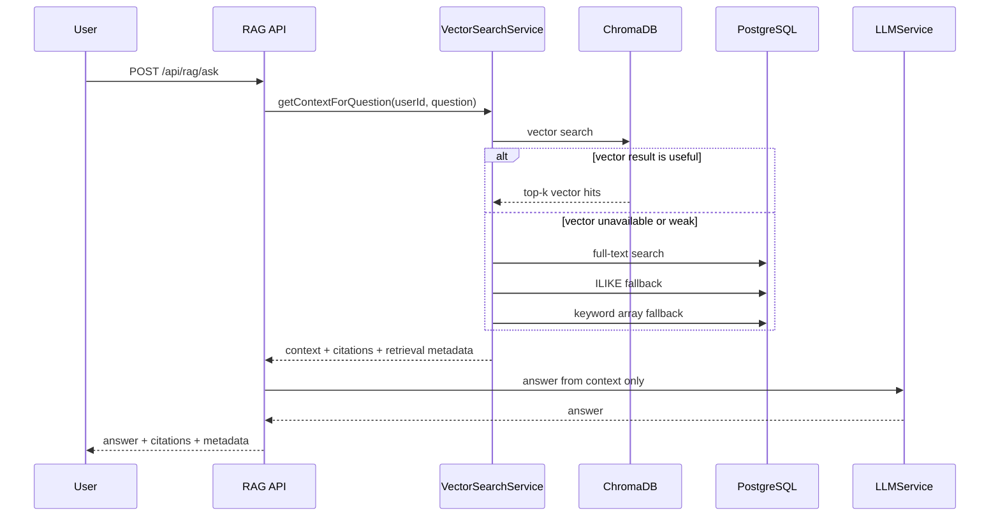

# AI Note Keeper Technical Retrospective

这份复盘面向代码评审和面试沟通：它说明项目解决了什么问题、系统如何拆分、RAG 链路如何工作、哪些工程化能力已经落地，以及后续还能如何演进。

## 1. 项目定位

AI Note Keeper 是一个笔记知识库应用。用户可以创建 Markdown/富文本笔记，配置自己的 LLM 和 Embedding Provider Key，然后基于个人笔记进行总结、改写、检索和 RAG 问答。

这个项目的重点不只是“调用大模型接口”，而是把 AI 能力接入到一个完整 Web 应用中：

- 有用户体系和鉴权边界。
- 有 PostgreSQL 持久化和迁移。
- 有 ChromaDB 向量索引。
- 有检索降级策略。
- 有 RAG 质量评测。
- 有 metrics、健康检查和部署回滚。
- 有前后端测试与 CI gate。

## 2. 架构概览

主要模块：

- `frontend/src`：React 页面、状态管理、API 客户端、i18n。
- `backend/src/controllers`：HTTP 请求处理和参数校验。
- `backend/src/models`：PostgreSQL 数据访问。
- `backend/src/services`：LLM、Embedding、RAG 检索、邮件验证码、图片上传等业务服务。
- `backend/src/observability`：Prometheus metrics。
- `backend/src/evals`：RAG 质量评测脚本。
- `deploy` 和 `scripts/iac`：生产部署、环境配置渲染和校验。

## 3. RAG 流程

检索策略是分层的：

1. ChromaDB 向量检索优先。
2. 如果向量检索失败或结果不可信，使用 PostgreSQL full-text search。
3. 如果全文检索不足，再使用 ILIKE 模糊匹配。
4. 最后用关键词数组匹配补足召回。

这样做的权衡：

- 优点：向量库不可用时仍能给出基于关键词的结果，系统可降级。
- 缺点：多层降级会增加解释成本，需要 metrics 观察每层命中情况。

## 4. RAG 质量评测

RAG eval 不只检查“接口能返回答案”，而是检查三个质量指标：

- `retrievalRecall`：期望来源笔记是否被召回。
- `citationAccuracy`：返回 citations 中有多少真正指向期望来源。
- `emptyContextRefusalRate`：没有相关上下文时，模型是否拒绝编造答案。

这三个指标能覆盖常见 RAG 风险：

- 召回不到正确文档。
- 引用看似存在但指错来源。
- 没有证据时仍然生成答案。

评测脚本输出 JSON report，失败时返回非零 exit code，适合放进 CI。

## 5. 安全设计

当前安全边界包括：

- JWT 鉴权，接口按当前用户隔离数据。
- 认证只依赖 httpOnly `auth_token` cookie；写请求通过 `csrf_token` + `X-CSRF-Token` 做 CSRF 防护。
- 用户级 LLM/Embedding Key，不使用服务端全局共享 Provider Key。
- API Key 和密码等敏感字段支持请求加密。
- API Key 入库前加密保存。
- 邮箱验证码用于注册和密码重置。
- CORS 白名单、Helmet、认证接口限流、请求体大小限制。
- 图片上传校验 MIME、魔数和大小，避免只信任文件名。

当前已经落地：

- OpenAPI schema 与主要请求体共用 Zod DTO，减少文档和运行时校验漂移。
- 增加安全审计日志，覆盖 Key 保存、删除、登录失败、鉴权失败等事件。
- 安全事件写入 Prometheus metrics，便于生产监控和告警。

仍需要继续加强的点：

- 更严格地区分生产和开发模式下的验证码返回行为。

## 6. 可观测性

后端已经提供：

- `/health/live`：进程存活检查。
- `/health/ready`：数据库和向量服务 readiness。
- `/metrics`：Prometheus 指标。
- 结构化请求日志。
- RAG 检索指标：
  - retrieval duration
  - retrieval result count by source
  - latest top score by source
- security events 指标：
  - event name
  - success/failure outcome

这些指标能回答面试中常见的运行时问题：

- 接口慢在哪里。
- RAG 主要依赖 vector 还是 fallback。
- 某次发版后检索结果数是否异常下降。
- ChromaDB 不可用时系统是否降级。

## 7. 部署链路

生产部署遵循 GitHub Actions 打包和手动部署流程：

1. Build Package 执行密钥扫描、配置校验、测试、lint、构建、迁移验证、E2E、RAG eval 和 artifact 上传。
2. Deploy Package 下载指定 package，上传到 ECS。
3. 服务端解压到 `/opt/ai-note-keeper/releases/<package-id>`。
4. 执行生产依赖安装和数据库迁移。
5. 切换 frontend/backend symlink。
6. reload PM2 和 Nginx。
7. 通过 `/health/ready` 做 smoke test。
8. 失败时回滚到上一版 release。

部署卫生：

- 保留最近 5 个 release。
- PM2/Nginx 日志集中到 shared logs。
- 日志默认保留 14 天。
- 生产 env 保存在 shared backend env，跨 release 复用。

## 8. 前端性能处理

前端使用 React Router。原始实现把所有页面静态 import 到首包里，导致主 chunk 偏大。当前改为页面级动态 import：

- 登录页和注册页按需加载。
- Home、NoteEditor、Chat、Settings 分页面拆分。
- Suspense 提供轻量加载状态。

这类优化适合在面试中解释为“先做路由级分包，避免过早做复杂 bundle 手工拆分”。

## 9. 关键权衡

- **静态 OpenAPI + Zod DTO vs 全自动生成**：当前选择保留静态规范，但把主要请求体 schema 交给 Zod 生成。这样文档仍容易读，运行时校验和接口文档也不会各写一套。
- **多层检索 vs 单一向量检索**：多层检索更稳健，但需要 metrics 和 eval 防止 fallback 掩盖质量问题。
- **用户级 Key vs 服务端共享 Key**：用户级 Key 更安全、更符合真实产品边界，但配置流程更复杂。
- **CI 中 RAG eval 使用 demo provider**：成本低、稳定，但不能完全代表真实模型质量。后续可增加真实 provider 的可选 nightly eval。
- **路由级分包 vs 深度手工分包**：路由级分包收益直接且风险低，后续再根据 bundle analyzer 做细分。

## 10. 下一步路线

优先级建议：

1. 继续扩大 RAG fixture，加入真实用户笔记样本和真实 Provider 的可选 nightly eval。
2. 把检索实验从文档表格升级为自动化实验脚本，输出 JSON 历史记录。
3. 为更多响应体补充 OpenAPI schema，并逐步减少手写 controller 校验。
4. 在生产监控中配置 security events 和 RAG retrieval metrics 的告警规则。
5. 基于 `frontend/dist/bundle-analysis.html` 继续拆分 Markdown preview 和 i18n namespace。
6. 增加审计日志查询视图或后台导出能力，便于排查安全事件。
